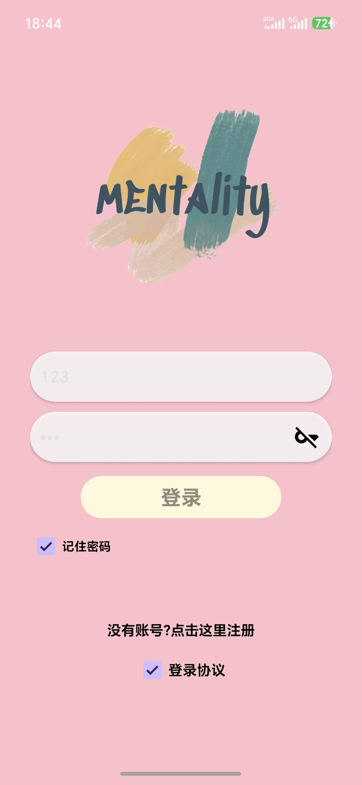
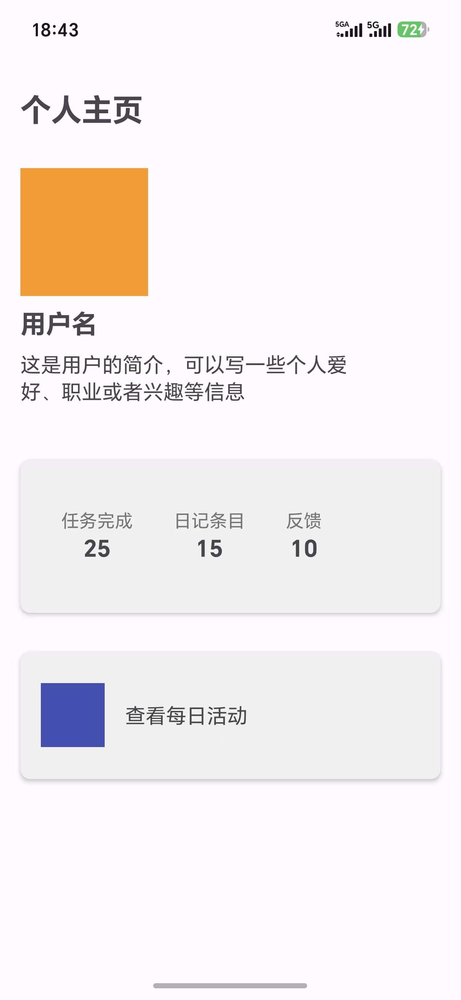
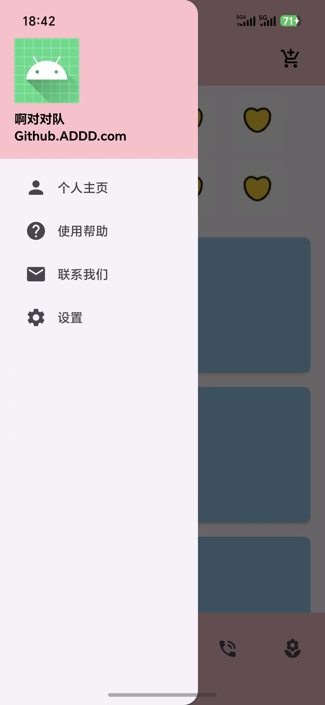
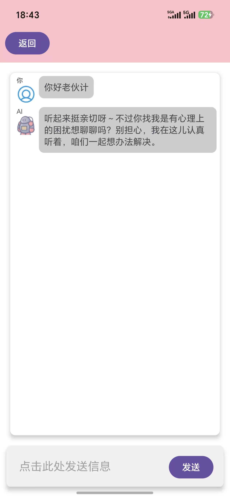
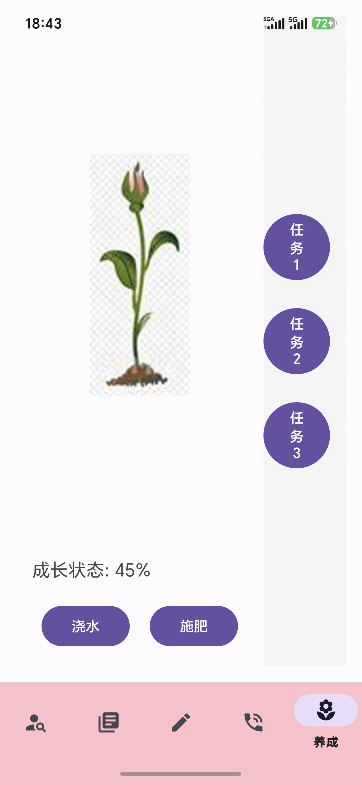

# MindBloom Mental Health Platform 🌱

An open-source mental health platform based on AI affective computing and positive psychology, focusing on preventive intervention and low-threshold services.
(Undergraduate Group Project)

## 🧠 Core Features

### Intelligent Emotion Monitoring
### Integrated with the ERNIE Bot Large Language Model
### Integrated with a News API
### Implemented Diary Functionality

## 📸 Screenshots

| 登录界面 | 个人主页 | 侧边栏 |
|:---:|:---:|:---:|
|  |  |  |

| 新闻界面 | AI 对话 |
|:---:|:---:|:---:|
|  |  |

| 养成系统 | 设置界面 |
|:---:|:---:|
|  |  |
